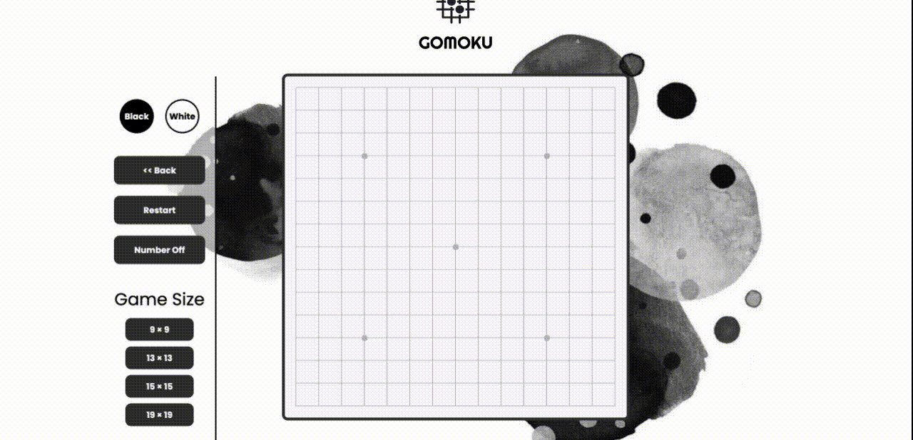

# gomoku
    


Online Javascript Gomoku. Enjoy spare time with your friend. Online preview: [ciaoshen.com](http://ciaoshen.com/gomoku)



## It can be easily integrated into your website 
1. Create your own website.
2. Import following files into your project,
    1) `gomoku.js`
    2) `gomoku.css`
    3) everything under `./assets/gomoku/` repository.
3. Call `gomoku` API in your own Javascript file as follow.

```js
import { gomoku } from './gomoku.js';

const defaultSize = 15;
const optionalSize = [9, 11, 13, 15, 19];
const container = document.querySelector('your-container');

/* initialize the gomoku modules */
gomoku.init(defaultSize);

/* insert modules into your web page */
gomoku.insertRollBackController(container);
gomoku.insertRestartController(container);
gomoku.insertToggleNumberController(container);
optionalSize.forEach(size => gomoku.insertResizeController(container, size));
gomoku.insertBoard(container);
```

Happy coding!